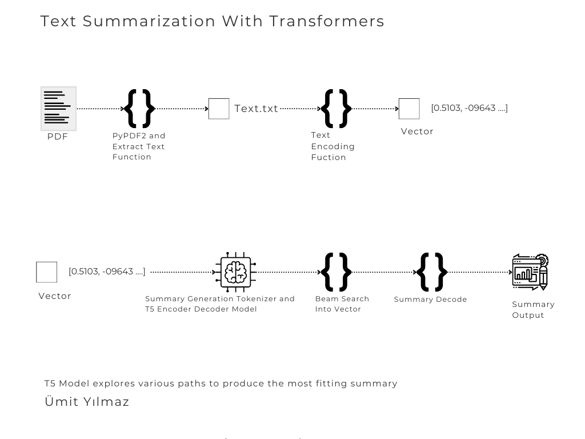

# Summarization And Transformers
This projects first aim is implement "Text Summarization With Transformers". The project uses PyPDF2 to extract text and uses T5 encoder-decoder model to find the best summary with its math 

# Project Pipeline



# Ready To Go Project
1- Open up a terminal and install libraries
   ```sh
   pip install -r requirements.txt
   ```

2- Then implement create a directory which name is content and add PDF docs inside.

3- Run the script.

### Folder Path

In Unix systems, file paths are written using forward slashes (/):

```python
# File path for Unix systems
images_dir_unix = "/images"
print(images_dir_unix)
```

In Windows systems, file paths are written using backslashes (\). However, in Python, backslashes are escape characters, so you should use double backslashes (\\) or raw strings:

```python
# File path for Windows systems (using double backslashes)
images_dir_windows = "\\images"
# or using raw strings
images_dir_windows_raw = r"\images"
print(images_dir_windows)
print(images_dir_windows_raw)
```

## License

This project is licensed under the MIT License - see the LICENSE file for details.

## Authors

List the authors of the project.

- **Ümit** - *Initial work* 


# Summarization And Transformers
Bu projenin öncelikli amacı "Transformatörlerle Metin Özetleme" görevini uygulamaktır. 
Proje, metni elde etmek için PyPDF2'yi kullanıyor ve arkasındaki matematiğiyle en iyi özeti bulmak için T5 kodlayıcı-kod çözücü modelini kullanıyor

# Proje Hattı


# Kullanıma Hazır Proje
1- Bir terminal açın ve kütüphaneleri yükleyin
```sh
   pip install -r requirements.txt
   ```
2- Daha sonra content adında bir dizin oluşturun ve içine PDF dokümanlarını ekleyin.

3- Komut dosyasını çalıştırın.

### Dosya Yolu

Unix sistemlerinde dosya yolları ileri eğik çizgi (/) kullanılarak yazılır:

```python
# Unix sistemleri için dosya yolu
images_dir_unix = "/images"
print(images_dir_unix)
```

Windows sistemlerinde dosya yolları geri eğik çizgi (\) kullanılarak yazılır. Ancak, Python'da geri eğik çizgi kaçış karakteri olduğundan, çift geri eğik çizgi (\\) kullanmalısınız veya ham string (`r`) kullanabilirsiniz:

```python
# Windows sistemleri için dosya yolu (çift geri eğik çizgi kullanarak)
images_dir_windows = "\\images"
# veya ham string kullanarak
images_dir_windows_raw = r"\images"
print(images_dir_windows)
print(images_dir_windows_raw)
```

## Lisans

Bu proje MIT Lisansı altında lisanslanmıştır - daha fazla bilgi için LICENSE dosyasına bakın.

## Yazarlar


- **Ümit** - *Başlangıç çalışması* 
